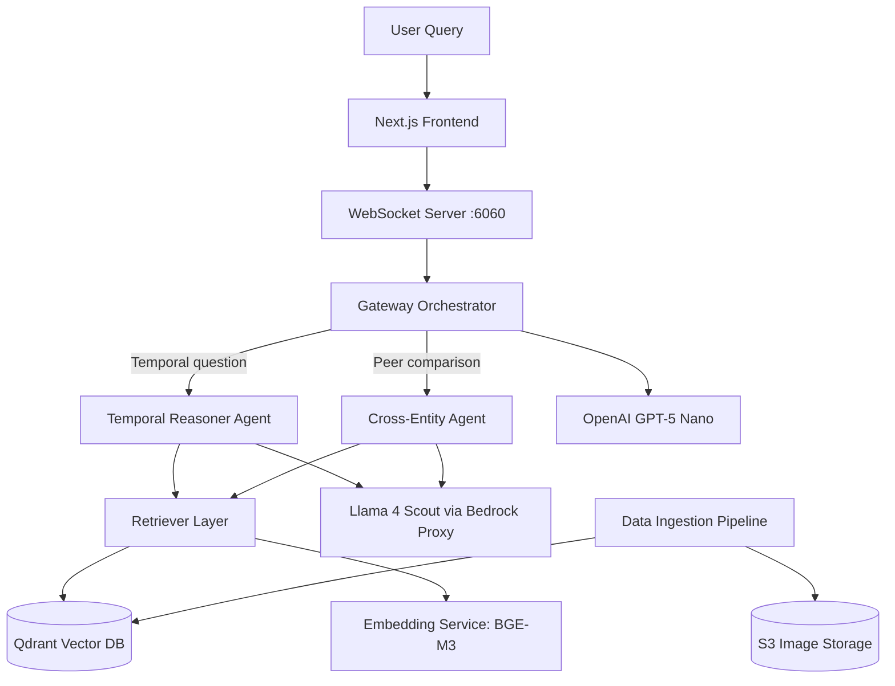
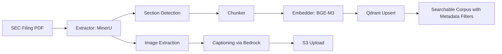
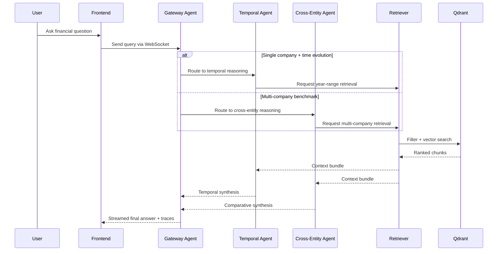

# Building a Financial Intelligence Platform with Multi-Agent AI, RAG, and Forensic Reasoning

Financial filings contain immense signal, but extracting actionable insight from thousands of pages across years and companies is difficult. This project turns raw SEC filings into a real-time intelligence system that can answer complex analytical questions, compare peers, and surface forensic red flags.

In this post, I’ll walk through the architecture, ingestion pipeline, and how the multi-agent backend collaborates with the frontend to deliver explainable financial analysis.

---

## The Problem

Analysts and auditors typically need to answer questions like:

- *How did a company’s risk posture evolve across years?*
- *How do two companies differ on margin narrative and cash discipline?*
- *Did management promises in prior filings translate into measurable outcomes?*

Traditional keyword search cannot reliably solve this because:

1. Context is fragmented across sections (MD&A, risk factors, footnotes).
2. Terminology varies across companies and time.
3. Answers require synthesis, not just retrieval.

---

## What This Platform Delivers

This platform provides:

- **Multi-agent orchestration** for routing analysis requests by intent.
- **Section-aware RAG** using BGE-M3 embeddings + Qdrant filtering.
- **Temporal and cross-entity reasoning** through specialized tools.
- **Forensic detection modes** (promise-vs-reality, anomaly detection, sentiment divergence).
- **Real-time execution visibility** in a Next.js interface via WebSockets.

---

## High-Level System Architecture

---

## End-to-End Data Ingestion Pipeline

The ingestion pipeline transforms raw PDFs into structured, retrievable knowledge:

1. Parse filename metadata (company, year, quarter/form type).
2. Extract text/tables/images from filings (MinerU).
3. Detect filing sections (Item 1, 1A, 7, 7A, 8, 9A, 13, etc.).
4. Chunk content with section continuity preserved.
5. Caption extracted images via Bedrock-powered model.
6. Generate BGE-M3 embeddings.
7. Store vectors + metadata in Qdrant.

---

## Query Routing and Reasoning Flow

A single user query can trigger multiple specialized tools based on intent.

---

## Why the Design Works

### 1) Better precision through metadata-aware retrieval
Instead of pure semantic similarity, retrieval includes payload filters such as company, year, section item, and filing type.

### 2) Better reasoning via specialist agents
Temporal and cross-entity reasoning are distinct tasks. Splitting them reduces prompt overload and improves result quality.

### 3) Better trust with execution transparency
The frontend streams intermediate execution events (tool calls, timelines, citations), making outputs easier to audit.

### 4) Forensic-first capabilities
Beyond generic Q&A, this project includes dedicated forensic workflows to detect narrative inconsistencies and accountability gaps.

---

## Core Technical Stack

- **Frontend:** Next.js 14, TypeScript, Tailwind, Zustand, Framer Motion
- **Orchestration:** Gateway-driven multi-agent backend
- **LLMs:** OpenAI GPT-5 Nano (coordination), Llama 4 Scout via Bedrock proxy (inner reasoning)
- **RAG:** BGE-M3 embeddings + Qdrant HNSW search + payload filtering
- **Ingestion:** MinerU extraction + section-aware chunking + image captioning + S3
- **Transport:** WebSocket streaming for real-time agent execution

---

## Example Outcomes

With the same underlying platform, teams can:

- Track whether management claims persisted, changed, or contradicted later filings.
- Compare peer disclosures on profitability, risk language, and strategic pivots.
- Detect unusual shifts in risk factors or governance language over time.

---

## Closing Thoughts

This project demonstrates that high-value financial intelligence is not only about stronger LLMs—it is about **architecture**: clean ingestion, filtered retrieval, specialized agents, and observable execution.

If you’re building AI systems for high-stakes domains (finance, legal, compliance), this pattern—**structured data pipeline + tool-using agents + transparent execution**—is a practical blueprint.

