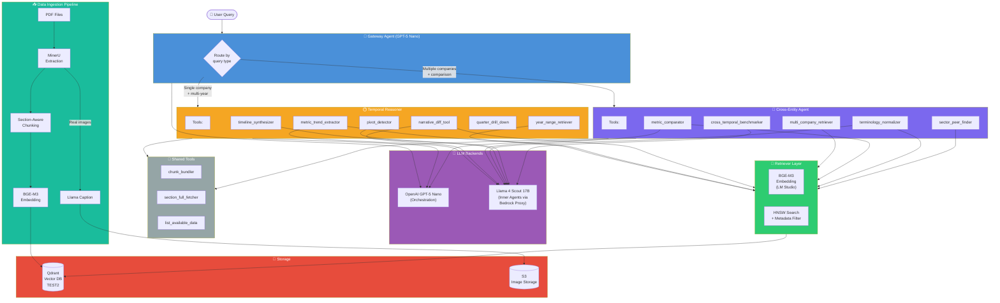

```mermaid
graph TB
    User([👤 User Query]) --> Gateway

    subgraph Gateway["🚦 Gateway Agent (GPT-5 Nano)"]
        Router{Route by<br/>query type}
    end

    Router -->|"Single company<br/>+ multi-year"| TR
    Router -->|"Multiple companies<br/>+ comparison"| CE

    subgraph TR["🕐 Temporal Reasoner"]
        direction TB
        TR_Tools["Tools:"]
        YRR[year_range_retriever]
        MTE[metric_trend_extractor]
        NDT[narrative_diff_tool]
        TS[timeline_synthesizer]
        QDD[quarter_drill_down]
        PD[pivot_detector]
    end

    subgraph CE["🏢 Cross-Entity Agent"]
        direction TB
        CE_Tools["Tools:"]
        MCR[multi_company_retriever]
        MC[metric_comparator]
        TN[terminology_normalizer]
        SPF[sector_peer_finder]
        CTB[cross_temporal_benchmarker]
    end

    subgraph Shared["🔧 Shared Tools"]
        CB[chunk_bundler]
        SFF[section_full_fetcher]
        LAD[list_available_data]
    end

    TR --> Shared
    CE --> Shared

    subgraph Retriever["📡 Retriever Layer"]
        direction LR
        EMB["BGE-M3<br/>Embedding<br/>(LM Studio)"]
        HNSW["HNSW Search<br/>+ Metadata Filter"]
    end

    subgraph Storage["💾 Storage"]
        QD[(Qdrant<br/>Vector DB<br/>TEST2)]
        S3[(S3<br/>Image Storage)]
    end

    subgraph LLMs["🤖 LLM Backends"]
        GPT["OpenAI GPT-5 Nano<br/>(Orchestration)"]
        Llama["Llama 4 Scout 17B<br/>(Inner Agents via<br/>Bedrock Proxy)"]
    end

    YRR & MTE & NDT & MCR & MC & TN & SPF --> Retriever
    Retriever --> QD
    MTE & NDT & MC & TN & TS & PD & CTB --> Llama
    Gateway --> GPT
    TR --> GPT
    CE --> GPT

    subgraph Ingestion["📥 Data Ingestion Pipeline"]
        direction LR
        PDF[PDF Files] --> MinerU[MinerU<br/>Extraction]
        MinerU --> Chunker[Section-Aware<br/>Chunking]
        Chunker --> Embed[BGE-M3<br/>Embedding]
        Embed --> QD
        MinerU -->|"Real images"| Caption[Llama Caption]
        Caption --> S3
    end

    style Gateway fill:#4A90D9,color:#fff
    style TR fill:#F5A623,color:#fff
    style CE fill:#7B68EE,color:#fff
    style Retriever fill:#2ECC71,color:#fff
    style Storage fill:#E74C3C,color:#fff
    style LLMs fill:#9B59B6,color:#fff
    style Ingestion fill:#1ABC9C,color:#fff
    style Shared fill:#95A5A6,color:#fff
```
